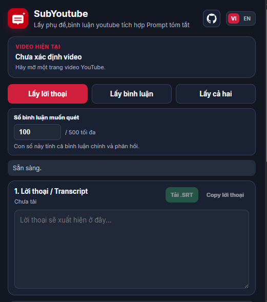
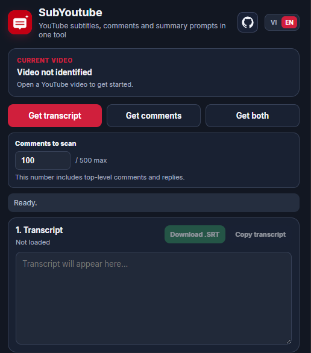

# SubYoutube

> Lấy phụ đề, bình luận YouTube tích hợp Prompt tóm tắt.  
> Extract YouTube subtitles and comments, then create copyable AI summary prompts.

## Table of contents / Mục lục

- [Tiếng Việt](#vietnamese)
  - [Giới thiệu](#overview-vi)
  - [Tính năng](#features-vi)
  - [Cài đặt](#installation-vi)
  - [Quyền và quyền riêng tư](#privacy-vi)
  - [Phản hồi và hỗ trợ](#support-vi)
- [English](#english)
  - [Overview](#overview-en)
  - [Features](#features-en)
  - [Installation](#installation-en)
  - [Permissions and privacy](#privacy-en)
  - [Feedback and support](#support-en)
- [Store links](#store-links)

---

## Vietnamese

### Overview VI

_Giao diện SubYoutube bằng tiếng Việt với transcript, bình luận và các nút tạo prompt._

**SubYoutube** là extension Manifest V3 dành cho Microsoft Edge, giúp bạn lấy transcript/phụ đề và bình luận từ video YouTube đang mở. Nội dung được hiển thị rõ ràng trong popup để bạn sao chép, nghiên cứu hoặc tạo prompt có cấu trúc cho các công cụ AI.

SubYoutube không phải sản phẩm chính thức của YouTube, Google hay bất kỳ nhà cung cấp AI nào. Extension chỉ hỗ trợ lấy và sắp xếp dữ liệu trên trang YouTube mà người dùng chủ động mở.

### Features VI

| Tính năng | Mô tả |
|---|---|
| Transcript theo phụ đề đã chọn | Lấy transcript theo track phụ đề mà người dùng đang chọn trên YouTube. |
| Bình luận và phản hồi | Thu thập tối đa 500 mục, gồm bình luận chính và các phản hồi đã mở rộng. |
| Hai khu vực riêng biệt | Transcript và bình luận được giữ riêng để sao chép độc lập. |
| Prompt AI | Tạo prompt transcript, prompt bình luận và prompt tổng hợp bằng tiếng Việt hoặc tiếng Anh. |
| Xuất SRT | Xuất transcript có timestamp thành file phụ đề `.SRT`. |
| Lưu tạm | Giữ kết quả theo từng video khi đóng và mở lại popup. |
| Tự dọn dữ liệu | Tự xóa bản quét quá 24 giờ và giữ tối đa 10 video gần nhất. |
| Giao diện song ngữ | Chuyển đổi giao diện giữa tiếng Việt và English. |

Transcript và bình luận không bị tự động dịch. Nội dung vẫn giữ nguyên theo track phụ đề và dữ liệu YouTube mà người dùng chọn. Extension không tự động gửi nội dung sang dịch vụ AI; người dùng chủ động sao chép khi muốn sử dụng.

### Installation VI

| Nền tảng | Liên kết |
|---|---|
| Microsoft Edge Add-ons | **Sắp cập nhật sau khi extension được xét duyệt** |
| Chrome Web Store | **Sắp cập nhật** |

Trong thời gian chờ cửa hàng xét duyệt, bạn có thể cài bản thử nghiệm trên Edge bằng cách mở `edge://extensions`, bật **Developer mode / Chế độ nhà phát triển**, chọn **Load unpacked / Tải giải nén**, rồi chọn thư mục có `manifest.json` ở cấp trực tiếp.

Sau khi extension được duyệt, các liên kết cài đặt chính thức sẽ được bổ sung tại phần [Store links](#store-links).

### Privacy VI

SubYoutube chỉ đọc transcript/phụ đề, bình luận, URL và tiêu đề video sau khi người dùng chủ động mở extension trên một trang video YouTube và yêu cầu quét. Dữ liệu được dùng để hiển thị, tạo prompt, sao chép, lưu tạm theo video và xuất SRT.

Dữ liệu được xử lý trong trình duyệt và không tự động gửi đến máy chủ SubYoutube hoặc nhà cung cấp AI bên ngoài. Kết quả quét được lưu tạm cục bộ, tự dọn sau 24 giờ và tối đa 10 trạng thái video gần nhất được giữ lại. Xem [PRIVACY.md](PRIVACY.md) để biết đầy đủ cách xử lý dữ liệu.

### Support VI

Nếu phát hiện lỗi hoặc muốn đề xuất tính năng, hãy mở [GitHub Issue](https://github.com/Tungronoro/SubYoutube/issues). Khi báo lỗi transcript, hãy ghi rõ ngôn ngữ phụ đề đang chọn và phiên bản Edge; không đăng mật khẩu, mã OTP, địa chỉ, số điện thoại hoặc dữ liệu riêng tư trong issue.

---

## English

### Overview EN

_SubYoutube interface in English with transcript, comments, and prompt actions._

**SubYoutube** is a Manifest V3 extension for Microsoft Edge that extracts the transcript/subtitles and comments from the YouTube video currently open in your browser. It presents the data in a focused popup so you can copy it, research it, or create structured prompts for AI tools.

SubYoutube is not an official product of YouTube, Google, or any AI provider. It only helps users read and organize data from a YouTube page that they intentionally open and scan.

### Features EN

| Feature | Description |
|---|---|
| Selected caption track | Extracts the transcript from the caption track currently selected by the user on YouTube. |
| Comments and replies | Collects up to 500 items, including top-level comments and expanded replies. |
| Separate sections | Keeps transcript and comments separate for independent copying. |
| AI prompts | Creates transcript, comments, and combined prompts in Vietnamese or English. |
| SRT export | Exports timestamped transcript cues as an `.SRT` subtitle file. |
| Temporary saving | Preserves results by video when the popup is closed and reopened. |
| Automatic cleanup | Removes scans older than 24 hours and retains up to 10 recent videos. |
| Bilingual interface | Switches the extension interface between Vietnamese and English. |

Transcripts and comments are not automatically translated. They remain in the form provided by the YouTube caption track and content selected by the user. The extension does not automatically send content to an AI service; the user chooses when to copy it elsewhere.

### Installation EN

| Platform | Link |
|---|---|
| Microsoft Edge Add-ons | **Coming soon after store approval** |
| Chrome Web Store | **Coming soon** |

While the store review is pending, you can test the extension in Edge by opening `edge://extensions`, enabling **Developer mode**, selecting **Load unpacked**, and choosing the folder that directly contains `manifest.json`.

Official installation links will be added to the [Store links](#store-links) section after the extension is approved.

### Privacy EN

SubYoutube reads transcript/subtitle content, comments, the current video URL, and the current video title only after the user opens the extension on a YouTube video and requests a scan. This data is used to display content, create prompts, copy text, save temporary video states, and export SRT files.

Data is processed in the browser and is not automatically sent to a SubYoutube server or an external AI provider. Scan results are stored locally, automatically pruned after 24 hours, and limited to the 10 most recent video states. See [PRIVACY.md](PRIVACY.md) for the complete data-handling policy.

### Support EN

If you find a bug or have a feature request, open a [GitHub Issue](https://github.com/Tungronoro/SubYoutube/issues). When reporting a transcript issue, mention the selected YouTube caption language and your Edge version. Do not post passwords, one-time codes, addresses, phone numbers, or private content in an issue.

---

## Store links

Các liên kết bên dưới sẽ được cập nhật sau khi Microsoft Edge Add-ons và Chrome Web Store cấp URL chính thức.

The links below will be updated after Microsoft Edge Add-ons and Chrome Web Store provide the official product URLs.

| Store | Status | Installation link |
|---|---|---|
| Microsoft Edge Add-ons | Pending review | To be updated |
| Chrome Web Store | Not submitted | To be updated |

## Project status

| Item | Status |
|---|---|
| Current version | 4.9.0 |
| Manifest | V3 |
| Primary test platform | Microsoft Edge Chromium |
| Store status | Preparing Edge submission |

## License

License information will be added together with the official release policy.
