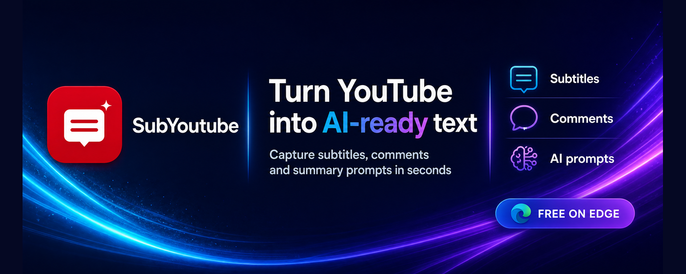

# SubYoutube

> Extract YouTube subtitles and comments, then create copyable AI summary prompts.  
> Lấy phụ đề, bình luận YouTube tích hợp Prompt tóm tắt.

## Table of contents / Mục lục

- [English](#english)
  - [Overview](#overview)
  - [Features](#features)
  - [Installation](#installation)
  - [Privacy](#privacy)
  - [Support](#support)
- [Tiếng Việt](#vietnamese)
  - [Giới thiệu](#giới-thiệu)
  - [Tính năng](#tính-năng)
  - [Cài đặt](#cài-đặt)
  - [Quyền riêng tư](#quyền-riêng-tư)
  - [Hỗ trợ](#hỗ-trợ)
- [Store links](#store-links)
- [❤️ Donate](https://tungronoro.github.io/SubYoutube/donate.html)

---

## English

### Overview

_SubYoutube interface in English with transcript, comments, and prompt actions._

**SubYoutube** is a Manifest V3 extension for Microsoft Edge that extracts the transcript/subtitles and comments from the YouTube video currently open in your browser. It presents the data in a focused popup so you can copy it, research it, or create structured prompts for AI tools.

SubYoutube is not an official product of YouTube, Google, or any AI provider. It only helps users read and organize data from a YouTube page that they intentionally open and scan.

### Features

| Feature | Description |
|---|---|
| Selected caption track | Extracts the transcript from the caption track currently selected by the user on YouTube. |
| Comments and replies | Collects up to 500 items, including top-level comments and expanded replies. |
| Separate sections | Keeps transcript and comments separate for independent copying. |
| AI prompts | Creates transcript, comments, and combined prompts in Vietnamese or English. |
| SRT export | Exports timestamped transcript cues as a readable `.SRT` subtitle file with short cues, up to two lines per cue, and non-overlapping timestamps. |
| Temporary saving | Preserves results by video when the popup is closed and reopened. |
| Automatic cleanup | Removes scans older than 24 hours and retains up to 10 recent videos. |
| Bilingual interface | Switches the extension interface between Vietnamese and English. |
| Store listing locales | Provides English and Vietnamese listing content for Microsoft Edge Add-ons. |
| Video download with SubVoice | Sends the current video URL to the SubVoice desktop app, which scans it and downloads the video with the quality, audio, and subtitle track you choose. Requires the SubVoice app to be installed. |

Transcripts and comments are not automatically translated. They remain in the form provided by the YouTube caption track and content selected by the user. The extension does not automatically send content to an AI service; the user chooses when to copy it elsewhere.

### Installation

| Platform | Link |
|---|---|
| Microsoft Edge Add-ons | [Install from Microsoft Edge Add-ons](https://microsoftedge.microsoft.com/addons/detail/subyoutube/gikmngbafagnnfognkcdjnhnljahbakc) |
| SubVoice desktop app (optional) | Used by the video download feature for YouTube videos. Install it from [SubVoice on GitHub](https://github.com/Tungronoro/SubVoice/releases). |

### Privacy

SubYoutube reads transcript/subtitle content, comments, the current video URL, and the current video title only after the user opens the extension on a YouTube video and requests a scan. This data is used to display content, create prompts, copy text, save temporary video states, and export SRT files.

Data is processed in the browser and is not automatically sent to a SubYoutube server or an external AI provider. The video download feature sends the current video URL to the SubVoice desktop app on your computer only after you click the download button. Scan results are stored locally, automatically pruned after 24 hours, and limited to the 10 most recent video states. See [PRIVACY.md](PRIVACY.md) for the complete data-handling policy.

### Support

If you find a bug or have a feature request, open a [GitHub Issue](https://github.com/Tungronoro/SubYoutube/issues). When reporting a transcript issue, mention the selected YouTube caption
